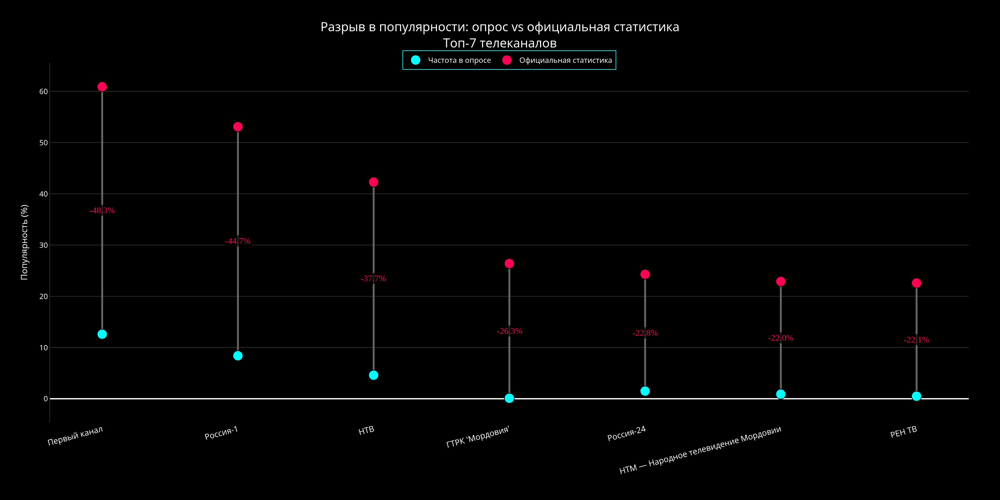

# Исходный год по аналитической алимпиаде "Я проффесионал"

##

*первый график ([исходный код](./src/graphs/graph8.py))*

*второй график ([исходный код](./src/graphs/graph9.py))*

*третий график ([исходный код](./src/graphs/graph12.py))*

*четвёртый график ([исходный код](./src/graphs/graph10.py))*

*пятый график ([исходный код](./src/graphs/graph11.py))*
