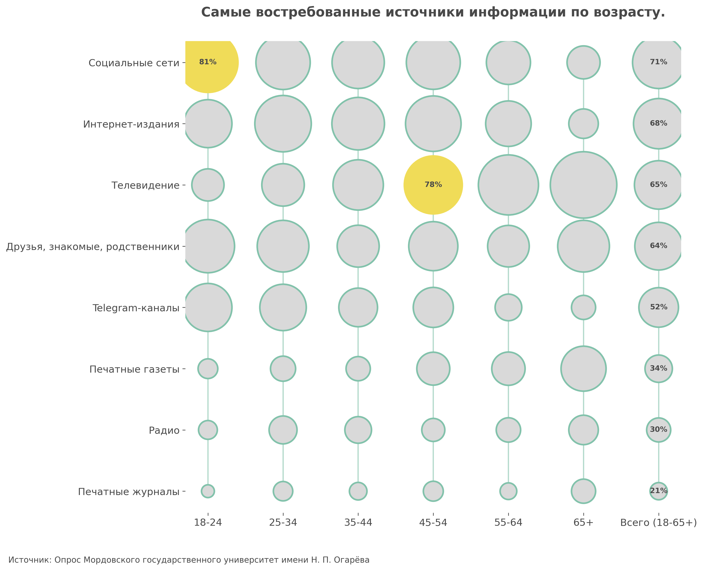
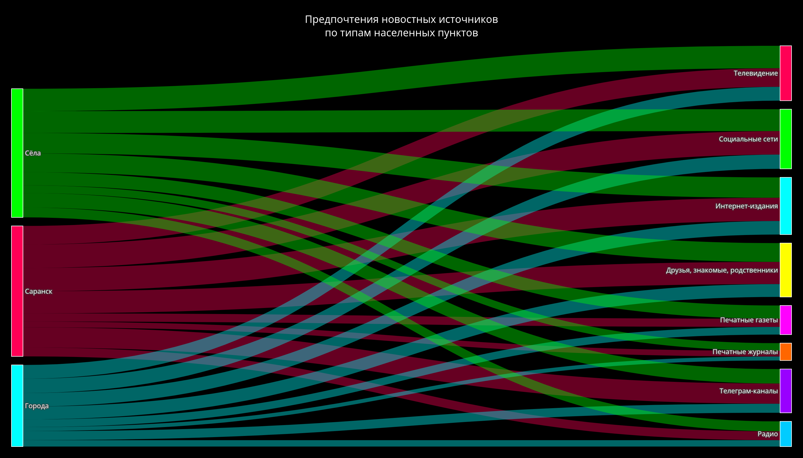
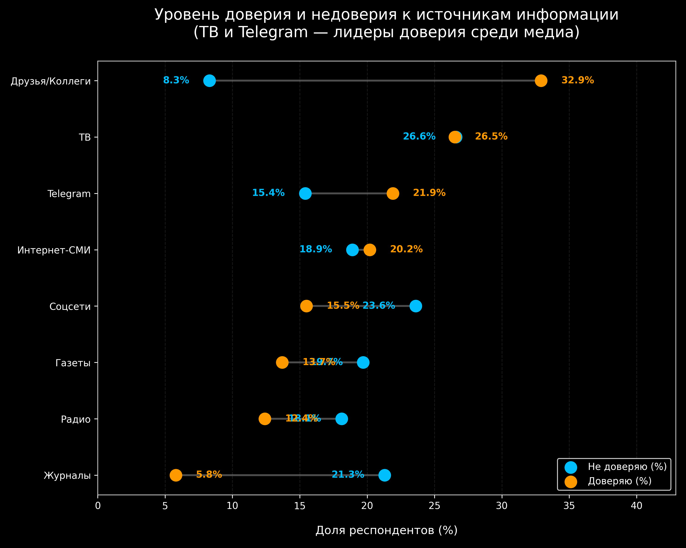
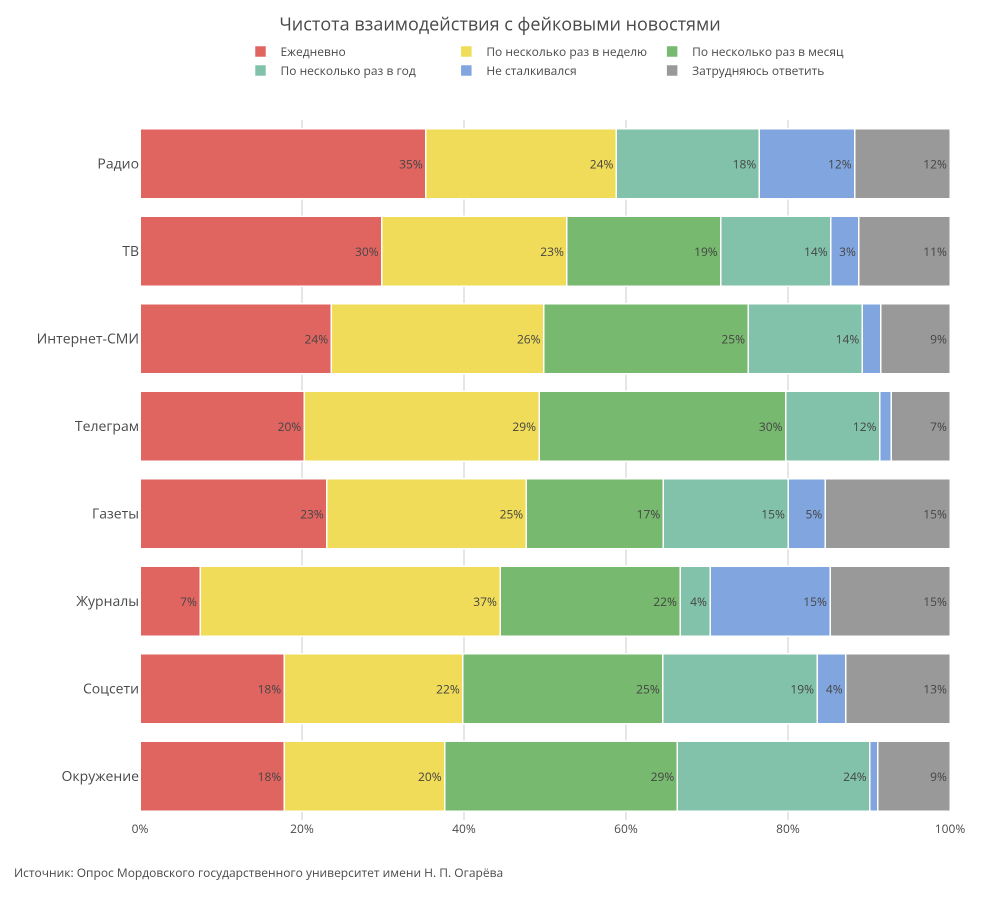

# Исходный код по аналитической олимпиаде "Я профессионал"

Тема работы: "Социологический опрос населения Республики Мордовия, посвящённый вопросам доверия, восприятия информации и отношения к фейковым новостям."

---

## Полученные в результате исследования графики

<div align="center">

[](./src/graphs/graph8.py)

***первый график*** ([исходный код](./src/graphs/graph8.py))

<br>

[](./src/graphs/graph9.py)

***второй график*** ([исходный код](./src/graphs/graph9.py))

<br>

[](./src/graphs/graph12.py)

***третий график*** ([исходный код](./src/graphs/graph12.py))

<br>

[](./src/graphs/graph11.py)

***пятый график*** ([исходный код](./src/graphs/graph11.py))

</div>

---

**Примечание:** Весь приведённый выше анализ, текстовые выводы и численные данные были получены с помощью скрипта исследования [src/scripts/research.py](./src/scripts/research.py)

---

## Установка и запуск

### Требования

- [uv](https://github.com/astral-sh/uv) - пакетный менеджер для Python
- [just](https://github.com/casey/just) - раннер команд (опционально, для удобства)

### Запуск скриптов

#### С помощью just (рекомендуется)

```bash
just run <номер_графика>  # Построить график (если не указать номер, то все сразу)
just research             # Запуск исследования
```

#### Прямой запуск с uv

```bash
uv run src/graphs/graph<номер графика>.py
uv run src/scripts/research.py
```
